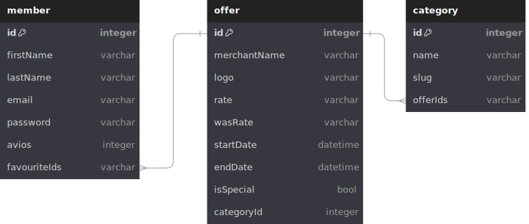

# IAG Loyalty Demo App

This document outlines the tools used to build the app, allowing for easy modification if necessary.

## Frontend

This is a new [**React Native**](https://reactnative.dev) project, bootstrapped using [`@react-native-community/cli`](https://github.com/react-native-community/cli). This frontend comes with the following toolings.

- [Jest](https://jestjs.io/docs/getting-started) and [Testing Library](https://testing-library.com/docs/react-native-testing-library/intro) for running tests
  - [Jest Config](../jest.config.ts)
  - [Jest Setup](../jest.setup.ts)
- [Eslint](https://eslint.org/docs/latest/use/getting-started)
  - [Eslint Config](../.eslintrc.js)
- [Prettier](https://prettier.io/docs/en/)
  - [Prettier Config](../.prettierrc.js)
- [Babel](https://babeljs.io/docs/)
  - [Babel Config](../babel.config.js)
- [Typescript](https://www.typescriptlang.org/docs/handbook/tsconfig-json.html)
  - [Typescript Config](../tsconfig.json)
  - [Typescript Testing Config](../tsconfig.spec.json)
- [Metro](https://reactnative.dev/docs/metro)
  - [Metro Config](../metro.config.js)
- [Redux Toolkit](https://redux-toolkit.js.org/introduction/getting-started)
- [Icons](https://oblador.github.io/react-native-vector-icons/)

## Backend

The application is equipped with a mock server that is configured using [Mirage JS](https://miragejs.com/docs/getting-started/introduction/). During the start-up in development mode, data is seeded and stored in memory. This is a low-level database that is meant only for development purposes. The database schema is provided below.

### Default seed data

The app's database is initialized with dummy data when you first start it up. This seed data includes offers, categories, a member, and member favorites. If you want to learn more about how Mirage JS utilizes seed data, check out their [guide](https://miragejs.com/tutorial/part-4/). Additionally, take a look at the mock API server to see how the seed data is created.
[Seed data](../src/mock-api/server.ts)

There is a default user that you can use to sign in to the app. The login credentials are available.

- email: `alex.bailey.test@avios.com`
- password: `Test@1234!`
