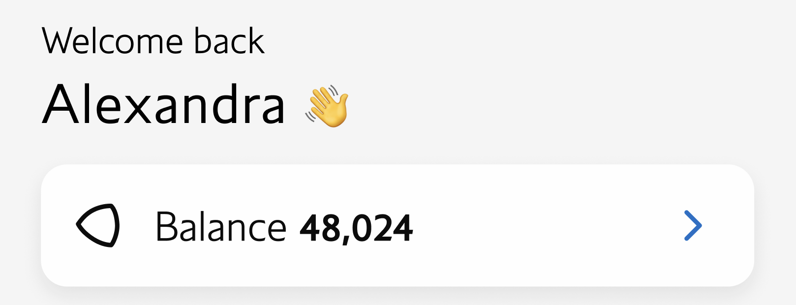

# Display Member First Name and Avios Points on the Home Screen

### User Story

> **As a** member that has signed into the App
>
> **I would like** to see my name, Avios points and a link to my account displayed in the app
>
> **So that** I can easily access my account information including the number of Avios points I have.

---

### Summary

#### Business Context

Members have reported that it is quite difficult to find their Avios balance on the app. They regularly use the app to check their balance. To make it easier for them to do so, it is recommended to add the member's name and Avios balance. This will not only help them to check their balance quickly but also encourage them to visit the app more often.

#### In Scope

- Add a component that displays the member's first name on the home screen along with a greeting `"Welcome back [member first name]"`
- Display the member's Avios balance
- Add a button that takes the member to the account screen

#### Out of Scope

- Displaying any other information about the member not mentioned above.

---

### Assumptions

- Member details are added to the Redux state when they log in.

---

### Acceptance Criteria

> **_Scenario 1 - Showing the Member's First Name and Avios Points_**
>
> **GIVEN** I have signed into the app
>
> **WHEN** When I have landed on the home screen
>
> **THEN** the app should display my first name and Avios points

---

> **_Scenario 2 - Navigating to the Accounts Screen_**
>
> **GIVEN** I am on the home screen
>
> **WHEN** I have clicked the "Go to Account" button
>
> **THEN** I should be navigated to the account screen

---

### Design



#### Hints

For the waving hand Icon, you can use the following;

```ts
import Ionicons from  'react-native-vector-icons/MaterialCommunityIcons';
...
<Ionicons  name="hand-wave-outline"  size={24}  />
```
